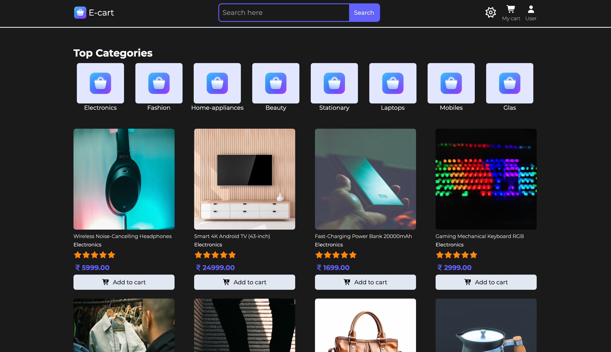
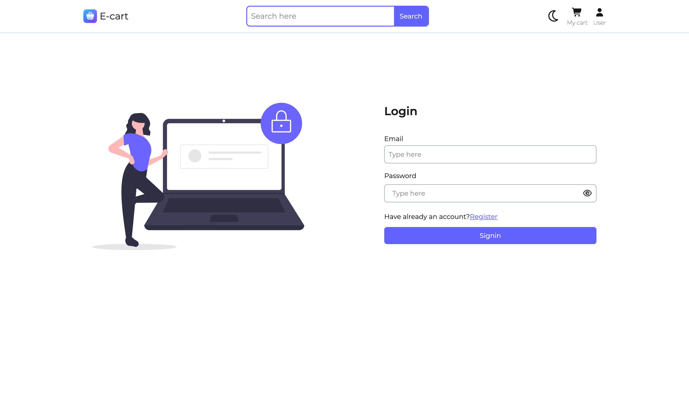
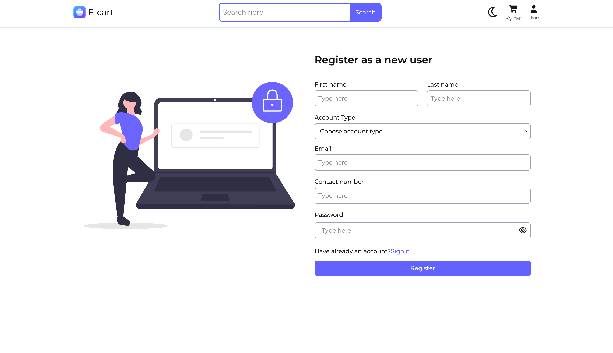
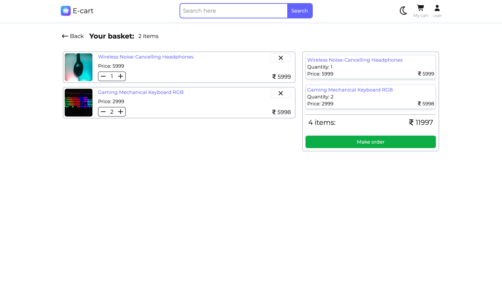
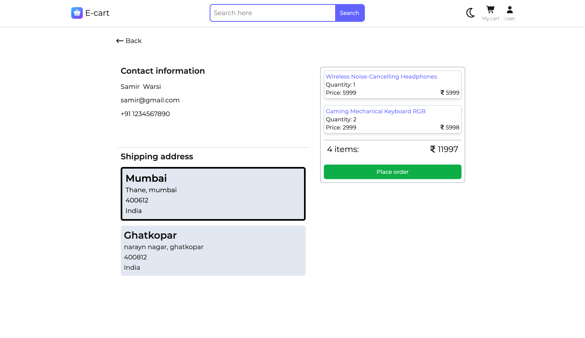
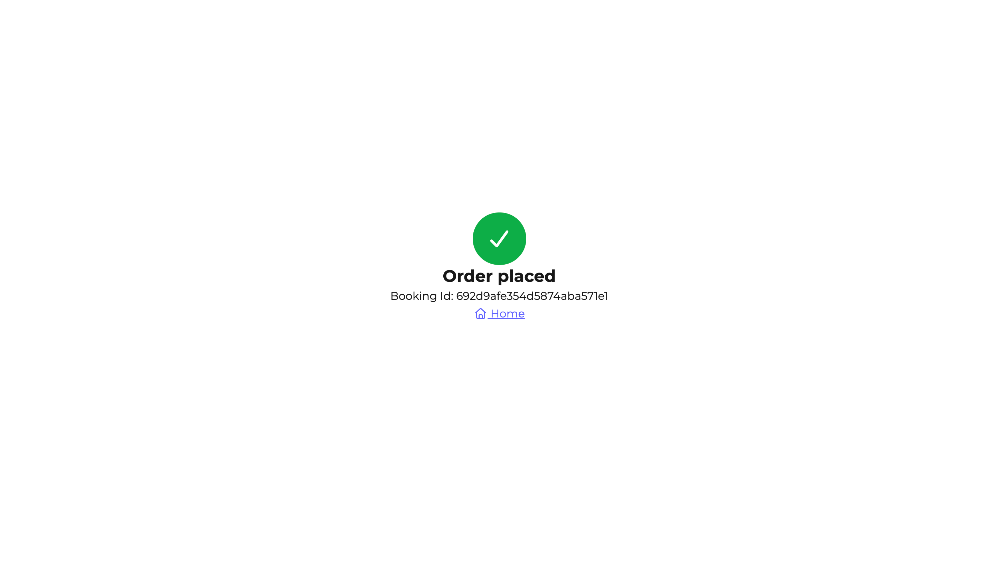
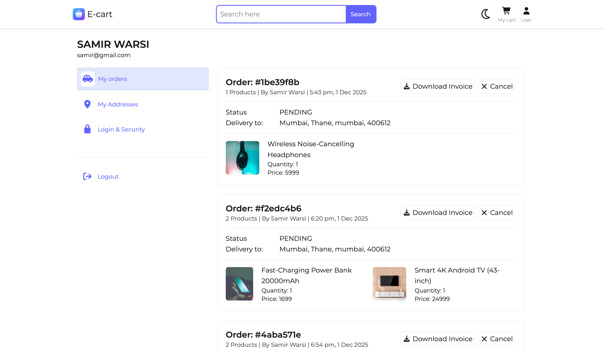
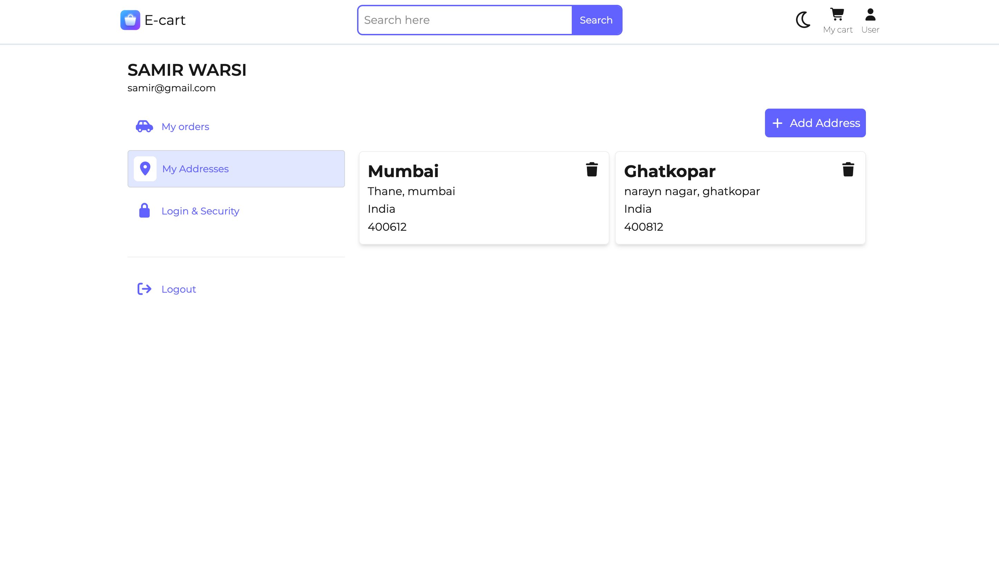
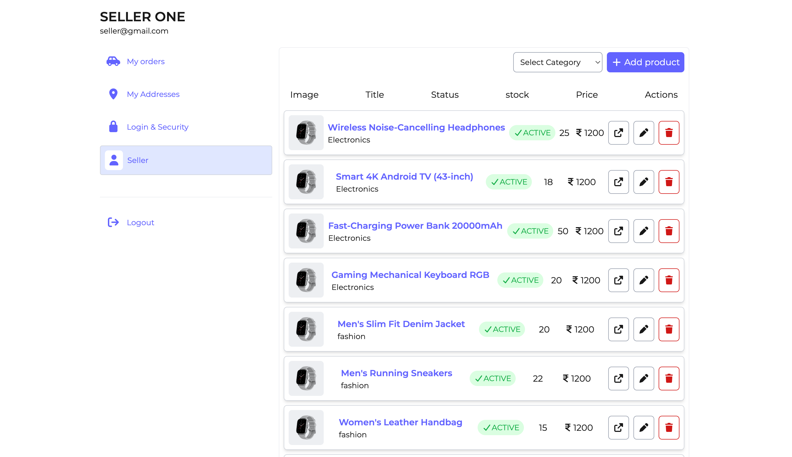
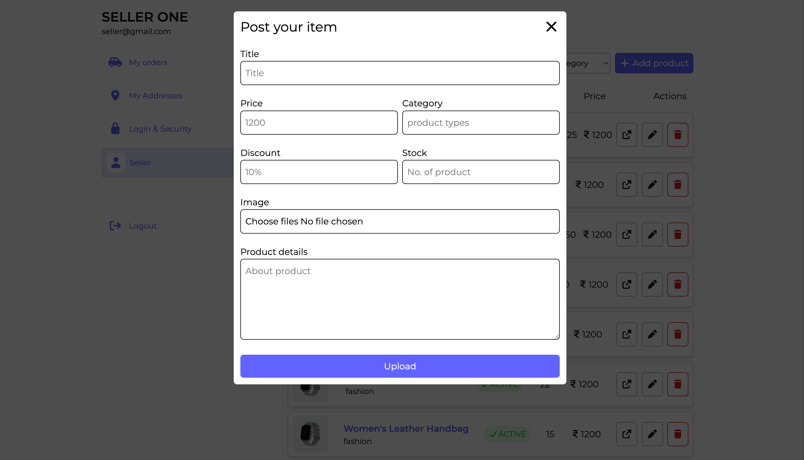

# 🛒 E-Cart Web Application

A full-stack, role-based e-commerce platform built using Node.js, Express, MongoDB, React.js, Redux Toolkit, Tailwind CSS, JWT, Multer, and Zod. The system supports three roles—User, Seller, and Admin—each with dedicated access and functionality.

## 🌐 Live Demo
🔗 [View Live Project](https://e-cart-frotend-app.onrender.com)

---

## 🚀 Tech Stack

- **Frontend**:
  - React.js
  - React Router
  - Redux Toolkit
  - Tailwind CSS
  - Zod (form validation)

- **Backend**:
    - Node.js
    - Express.js
    - MongoDB (Mongoose)
    - Multer (image upload)
    - JWT (authentication)
    - Bcrypt (password hashing)

---
## 👥 User Roles & Features

- **User**:
    - Browse all products
    - Search and filter products
    - Add/remove items from cart
    - Increase/decrease product quantity
    - Book/place orders with address selection
    - View order history
    - Cancel orders
    - Print receipts for completed orders

- **Seller**:
    - Upload products with images
    - Edit product details
    - Activate/Deactivate products
    - Delete products
    - View all orders related to their products

- **Admin**:
    - Full platform control
    - Manage users, sellers, products, and orders
    - Monitor overall application activities

---

## 🧩 Core Features
 - Secure JWT-based authentication system
 - Role-Based Access Control (RBAC)
 - Fully responsive UI using Tailwind
 - Optimized state management with Redux Toolkit
 - Clean API structure following REST principles
 - Product image uploads using Multer
 - Form validation and data safety with Zod

---


## 📦 Folder Structure (Simplified)
/frontend 
    /src 
        /components 
        /pages 
        /redux 
        /utils 

/backend 
    /config
    /controllers 
    /models 
    /routes 
    /middlewares 
    /config
    /uploads
    /utils

---

## 🖨 Receipt Print Feature

Users can print a formatted receipt for any completed order.

---

## 🛠 Installation & Setup

1. **Clone the Repository**:
    ```bash
    https://github.com/warsi0707/E-CART
    ```
2. **Install Dependecies**:
    ```bash
    cd frontend
    npm install
    ```
    ```bash
    cd backend
    npm install
    ```
3. **Setup Environment Variables**:
    ```bash
    Create a .env file in /server:
    MONGO_URI=your_mongo_url
    JWT_SECRET=your_secret_key
    ```

4. **Run the App**:
    Frontend
    npm run dev

    Backend
    npm start


## Screenshots

### Homepage


### Homepage2


### Dark pages


### Detail Page


### Signup and signin



### Cart items


### Place order



### User account




### Seller Account




